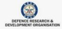
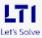

## About Me
   

Hi! I am <b> Neha Narang</b>, a software manual/automation tester and developer. I have worked in defect management, manaul testing, automation testing using Selenium and Cucumber, Automation using RPA (UiPath), Java, .Net framework, C#, Python, and Machine Learning . 

I am a strong believer in <i> "Sky is the limit!"</i>

## Technical Competencies
           

## Organisations worked for
[GitHub_Logo](FDMGroup.JPG)    

